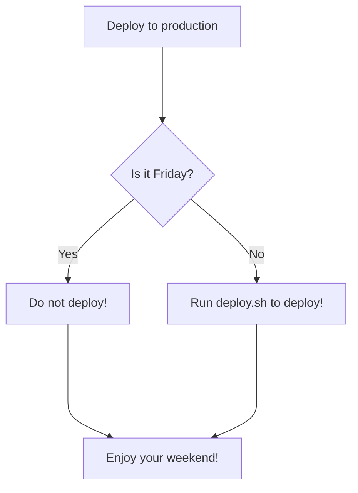
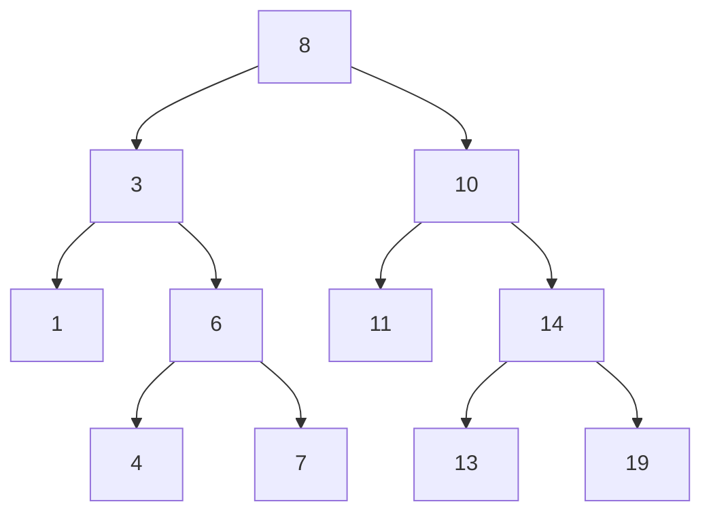
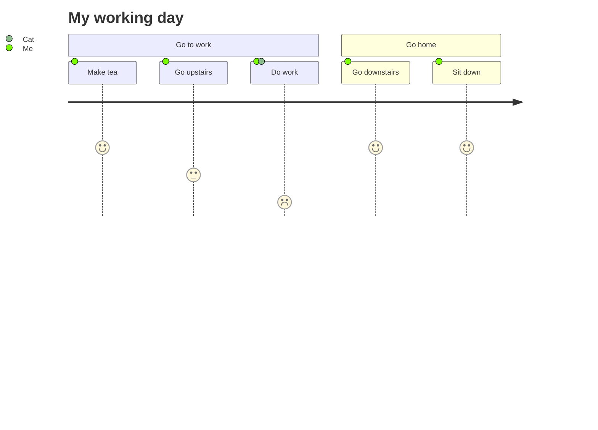

## Include diagrams in your Markdown files with Mermaid

## Example 1

## Example 2

***

## Example 3

***

## Resource 

* [Github Blog - Include diagrams in your Markdown files with Mermaid](https://github.blog/2022-02-14-include-diagrams-markdown-files-mermaid/)
* [Mermaid Docs](https://mermaid-js.github.io/mermaid/#/)
