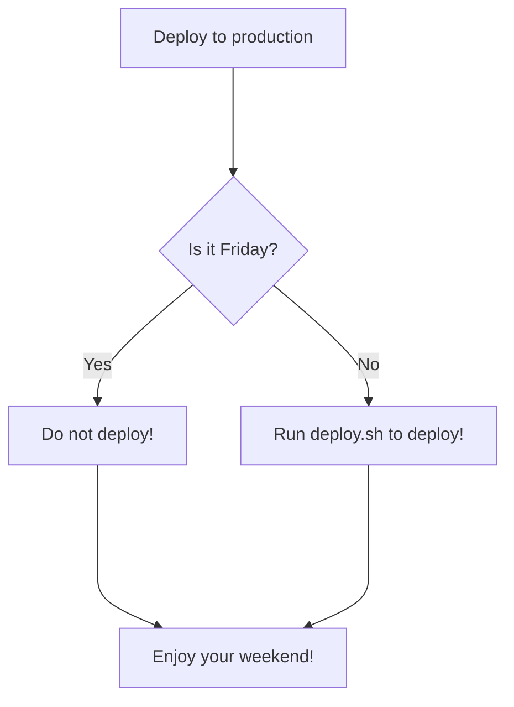
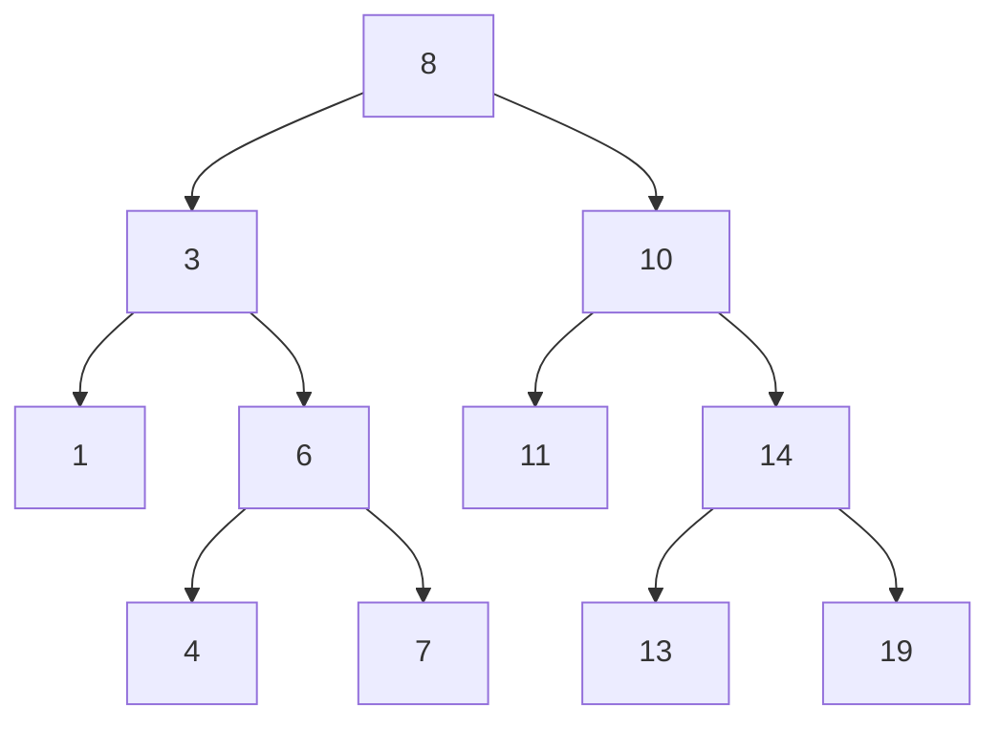
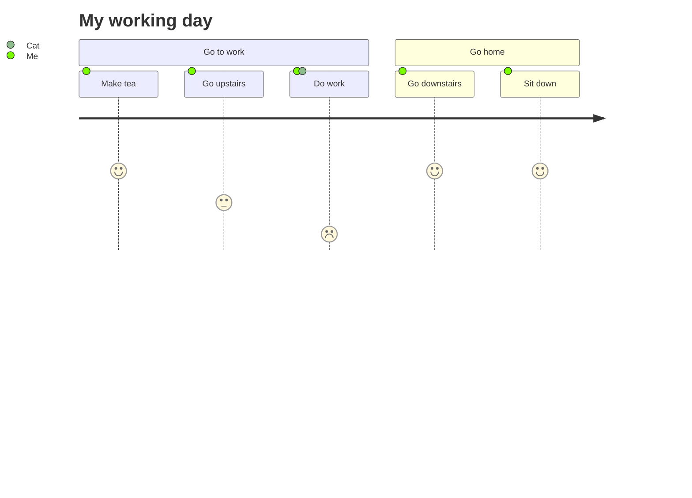

## Include diagrams in your Markdown files with Mermaid

## Example 1

## Example 2

***

## Example 3

***

## Resource 

* [Github Blog - Include diagrams in your Markdown files with Mermaid](https://github.blog/2022-02-14-include-diagrams-markdown-files-mermaid/)
* [Mermaid Docs](https://mermaid-js.github.io/mermaid/#/)
* [Mermaid Live Editor](https://mermaid-js.github.io/mermaid-live-editor/edit#pako:eNpVkM-KwkAMxl8l5OSCfYEeBG3Vi6Cgt46H0InOIPOHdMoibd99p5aF3ZyS7_t9IWTANmjGEp9C0cCtVh5ybZvKiO2So-4ORbEZj5zABc_vEXarY4DOhBitf34t_G6GoBpOM8aQjPWvabGqT_7seYS6OVFMId7_OrfvMMK-sReT1_93jHBOHZoHlQ8qWhKoSD4IrtGxOLI6nz7MisJk2LHCMrea5KVQ-SlzfdSUeK9tCoJlkp7XSH0K17dvf-eFqS3lL7hFnH4ABg5bBA)
